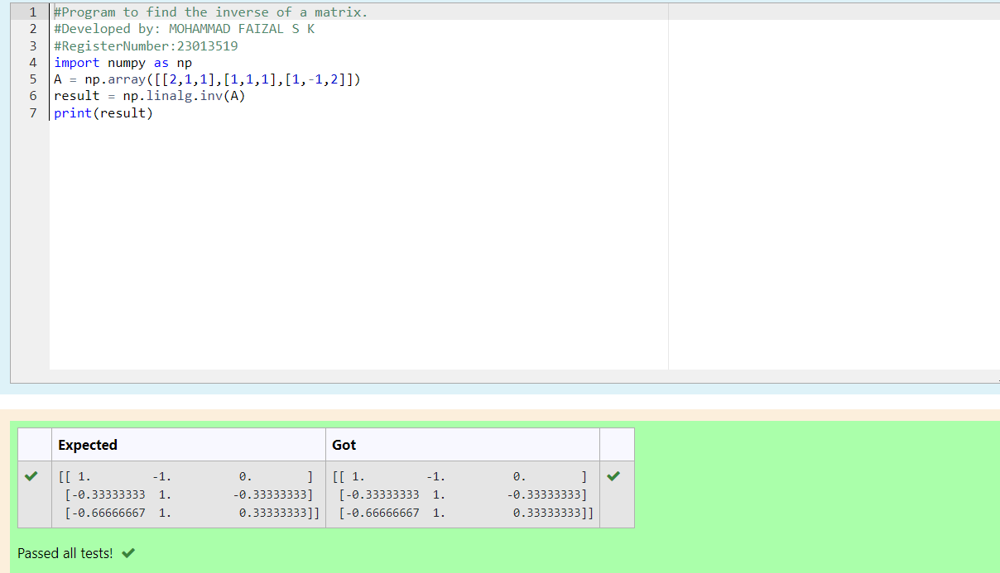

# INVERSE-OF-A-MATRIX
## Aim:
To write a python program to find the inverse of a matrix
## Equipment’s required:
1. 	Hardware – PCs
2. 	Anaconda – Python 3.7 Installation / Moodle-Code Runner
## Algorithm:
### Step1 : 
Import the module numpy and assign numpy as np

### Step 2:

Create an variable named 'a' and use np.array() for the matrix values by first list as first row

### Step 3:

Create an variable named 'inv' and use np.linalg.inv(a) to inverse the matrix

### Step 4:

Print the value
## Program:
```py
#Program to find the inverse of a matrix.
#Developed by: MOHAMMAD FAIZAL S K
#RegisterNumber:23013519
import numpy as np
A = np.array([[2,1,1],[1,1,1],[1,-1,2]])
result = np.linalg.inv(A)
print(result)
```
## Output:

## Result:
Thus the inverse of given matrix is successfully solved using python program

